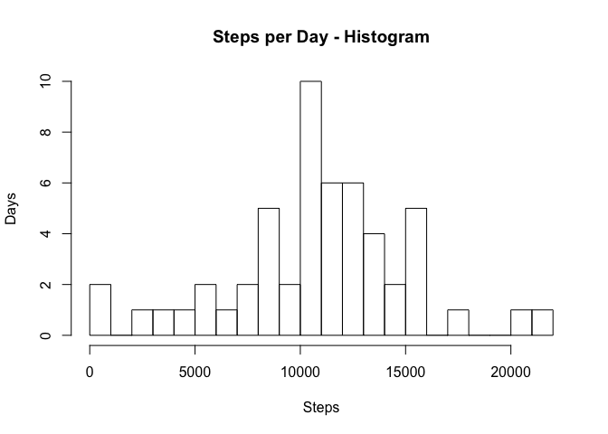
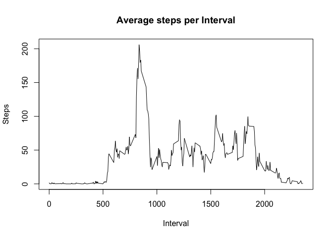
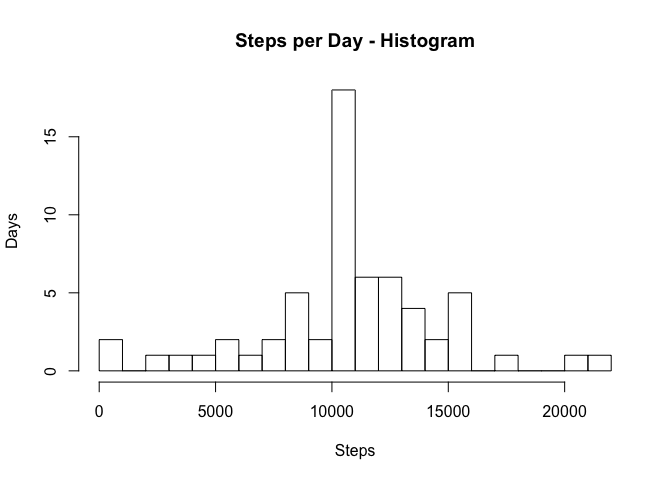
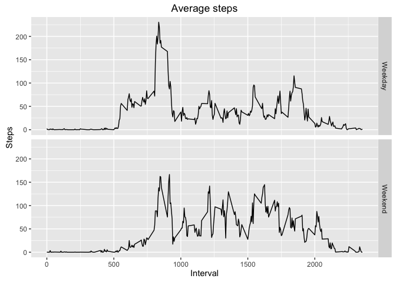

# Reproducible Research: Peer Assessment 1


## Loading and preprocessing the data
Read data from csv file in current directory

```r
steps_data <- read.csv("activity.csv")
```

Remove NAs from the data and create tidy data

```r
tidy_steps_data <- steps_data[!is.na(steps_data$steps),]
```
## What is mean total number of steps taken per day?

Total number of steps taken per day

```r
steps_per_day <- aggregate(tidy_steps_data$steps, list(tidy_steps_data$date), sum)
colnames(steps_per_day) <- c("date", "steps")
```

Histogram of the total number of steps taken each day

```r
hist(steps_per_day$steps, breaks=20, main="Steps per Day - Histogram", ylab="Days", xlab="Steps")
```

<!-- -->

Mean of the total number of steps taken per day

```r
mean_steps_per_day <- mean(steps_per_day$steps)
mean_steps_per_day
```

```
## [1] 10766.19
```

Median of the total number of steps taken per day

```r
median_steps_per_day <- median(steps_per_day$steps)
median_steps_per_day
```

```
## [1] 10765
```

## What is the average daily activity pattern?
Time series plot (i.e. 𝚝𝚢𝚙𝚎 = "𝚕") of the 5-minute interval (x-axis) and the average number of steps taken, averaged across all days (y-axis)

```r
steps_per_interval <- aggregate(tidy_steps_data$steps, list(tidy_steps_data$interval), mean)
colnames(steps_per_interval) <- c("interval", "steps")
plot(steps_per_interval$interval, steps_per_interval$steps, type="l", xlab="Interval", ylab="Steps", main="Average steps per Interval")
```

<!-- -->

5-minute interval, on average across all the days in the dataset, that contains the maximum number of steps

```r
steps_per_interval[which.max(steps_per_interval$steps),]$interval
```

```
## [1] 835
```
## Imputing missing values
Total number of missing values in the dataset (i.e. the total number of rows with NA

```r
sum(is.na(steps_data))
```

```
## [1] 2304
```
Fill in all of the missing values in the dataset with the average in the particular interval across all days.

```r
for(i in 1:nrow(steps_data)){
  steps_data[i,1] <- ifelse(is.na(steps_data[i,1]), steps_per_interval[steps_per_interval$interval == steps_data[i,3], 2], steps_data[i, 1])
}
imputed_steps_data <- steps_data
```
Histogram of the total number of steps taken each day

```r
steps_per_day <- aggregate(imputed_steps_data$steps, list(imputed_steps_data$date), sum)
colnames(steps_per_day) <- c("date", "steps")
hist(steps_per_day$steps, breaks=20, main="Steps per Day - Histogram", ylab="Days", xlab="Steps")
```

<!-- -->

Mean total number of steps taken per day.

```r
mean(steps_per_day$steps)
```

```
## [1] 10766.19
```
Median total number of steps taken per day.

```r
median(steps_per_day$steps)
```

```
## [1] 10766.19
```

The mean and median values are higher than the values before replacing NAs with average across all days in the interval.

## Are there differences in activity patterns between weekdays and weekends?
New factor variable in the dataset with two levels – “weekday” and “weekend” indicating whether a given date is a weekday or weekend day.

```r
steps_data$day <- weekdays(as.Date(steps_data$date, format = "%Y-%m-%d"))
steps_data[steps_data$day == "Sunday" | steps_data$day == "Saturday", 4] <- "Weekend"
steps_data[steps_data$day != "Weekend", 4] <- "Weekday"
steps_data$day <- factor(steps_data$day)
```
Panel plot containing a time series plot of the 5-minute interval (x-axis) and the average number of steps taken, averaged across all weekday days or weekend days (y-axis)

```r
average_steps <- aggregate(steps_data$steps, list(steps_data$day, steps_data$interval), mean)
colnames(average_steps) <- c("day", "interval", "steps")
require("ggplot2")
```

```
## Loading required package: ggplot2
```

```
## Warning: package 'ggplot2' was built under R version 3.2.3
```

```r
ggplot(average_steps, aes(x = interval, y = steps)) + facet_grid(day ~ ., ) + geom_line() + xlab("Interval") + ylab("Steps") + ggtitle("Average steps")
```

<!-- -->
